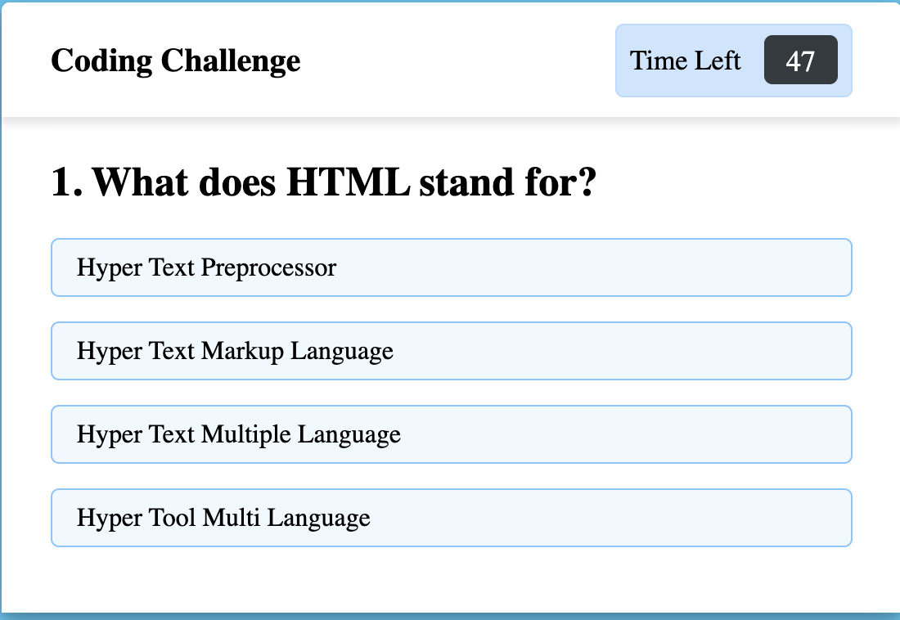

# Code-Quiz
This is a coding quiz game that tracks your score and ranks it.

# Built With
* HTML
* CSS
* JavaScript

1. This is a timed quiz that deducts time if an answer is answered incorrectly.
2. Once the timer gets to zero or all questions are answered, the game ends and the user is asked to enter their name so it can be ranked.
3. If the score is greater than the previous high scores, the new score will replace it.

[URL of deployment](https://chrispruiz.github.io/Code-Quiz/)

[GitHub Repository Link](https://github.com/Chrispruiz/Code-Quiz.git)

